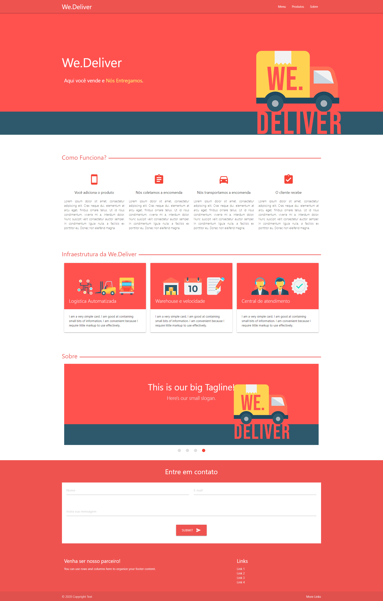
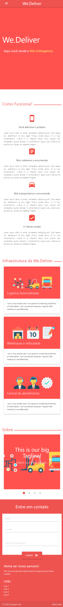

# Projeto-Materialize

## Objetivo do Projeto 
O projeto teve como objetivo utilizar o framework Materialize em uma landing page, utilizando a biblioteca disponivel, compreendendo o uso de material design, reuso de classes e componentes, manipulação de elementos de biblioteca, atomic design, etc.

## Desktop Viewport 

## Mobile Viewport 

